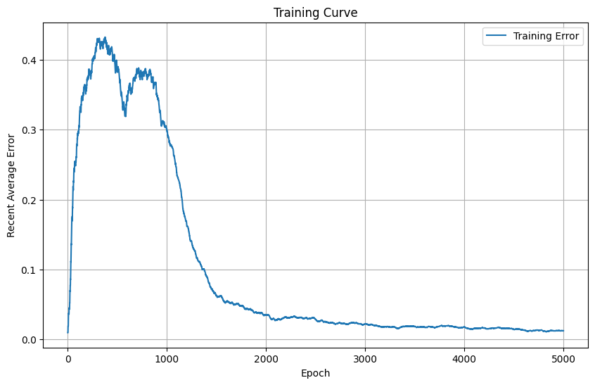

# Neural Network Binary XOR Classifier in C++
A Simple Neural Network from Scratch in C++ trained to classify XOR data.
Only "tested" with Net Average Training Error, No Train/Test Split. Check out the [code](lab) to the classifier & the training data generator.
Network Architecture very simple, 2 input neurons, hidden layer with 4 neurons and output neuron as binary classifier.
Visualization done with Python, files can be found in [Visualization](Visualization).

Kind regards to [this video](https://www.youtube.com/watch?v=sK9AbJ4P8ao) for inspiration.
